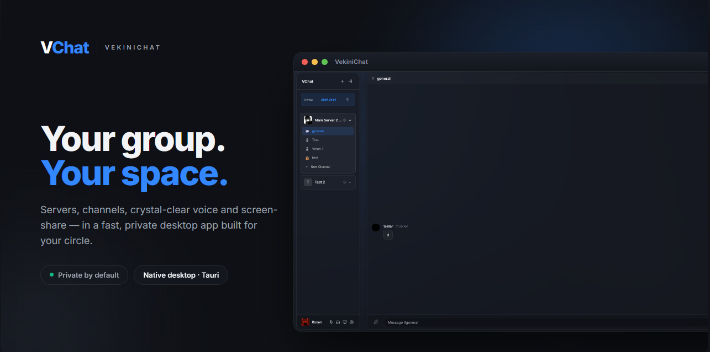
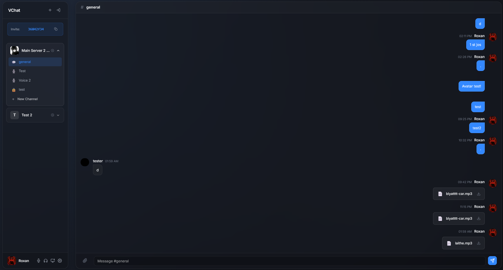
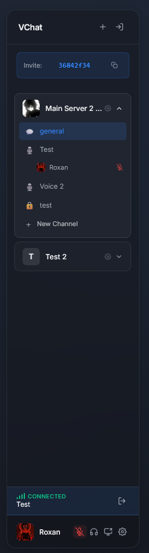
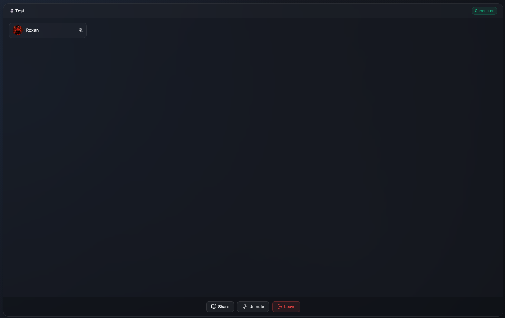
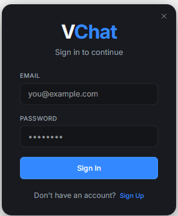

# VekiniChat



A private, lightweight **voice & text chat app for friends** — think *"Discord, but yours."* Create servers, organize channels, hop into voice channels, share your screen, and manage roles — all in a fast, premium **native desktop app**.

Built with **Tauri** (native desktop), **Vite** + vanilla JS, **Supabase** (auth & data), and **LiveKit** (real-time voice/video).

## Screenshots

<table>
  <tr>
    <td width="66%" valign="top"><br/><sub><b>Text channels</b> — clean, glassy chat with attachments.</sub></td>
    <td width="34%" valign="top"><br/><sub><b>Servers & channels</b> — text + voice, with live presence.</sub></td>
  </tr>
  <tr>
    <td width="66%" valign="top"><br/><sub><b>Voice channels</b> — mute, deafen, screen-share, per-user volume.</sub></td>
    <td width="34%" valign="top"><br/><sub><b>Sign in</b> — frosted-glass auth.</sub></td>
  </tr>
</table>

## Features

- 🏠 **Servers & channels** — text *and* voice channels, organized your way
- 🎙️ **Crystal-clear voice** (LiveKit) — mute, deafen, and per-user volume
- 🖥️ **One-click screen sharing**
- 🛡️ **Roles & permissions** (RBAC) — keep moderation simple
- ✨ **Premium glassmorphism UI** — frosted panels, soft depth, custom title bar
- ⚡ **Native desktop app** (Tauri) — lightweight and fast
- 🔒 **Private by default** — powered by your own Supabase project

## Stack

| Concern | Choice |
| ------- | ------ |
| Desktop shell | Tauri 2 |
| Build / dev | Vite 7 |
| UI | Vanilla JS + CSS (glassmorphism) |
| Auth & data | Supabase |
| Real-time voice/video | LiveKit |

## Getting started

### Prerequisites
- Node 18+
- A [Supabase](https://supabase.com) project (free tier is fine)
- A [LiveKit](https://livekit.io) project for voice (Cloud free tier works)
- For the native desktop build: the [Rust toolchain](https://rustup.rs) (Tauri only)

### 1. Install
```bash
npm install
```

### 2. Configure environment
```bash
cp .env.example .env
```
Fill in your Supabase credentials:
```
VITE_SUPABASE_URL=https://your-project.supabase.co
VITE_SUPABASE_ANON_KEY=your-anon-public-key
```

### 3. Set up the database
In the Supabase **SQL Editor**, run [`supabase_rbac_migration.sql`](supabase_rbac_migration.sql) to create the tables, roles, and row-level-security policies.

> Voice uses a Supabase Edge Function (`livekit-token`) to mint LiveKit access tokens — point it at your LiveKit project's API key/secret.

### 4. Run
```bash
npm run dev          # web dev server (http://localhost:5173)
npm run desktop:dev  # native desktop app (requires Rust)
```

## Project structure

```
src/
  main.js              App bootstrap + wiring
  auth.js              Supabase auth
  api.js               Server / channel / permission queries
  supabase.js          Supabase client
  voice.js             LiveKit voice: join/leave, mute, deafen, screen-share
  ui/
    auth.js            Auth screen
    sidebar.js         Servers, channels, presence
    settings.js        User + server settings, roles, keybinds
  style.css            Glassmorphism theme
src-tauri/             Tauri (Rust) desktop shell
supabase_rbac_migration.sql   Schema + RLS
```

---

<sub>A personal project exploring real-time apps — designed and built by Dan Calin.</sub>
